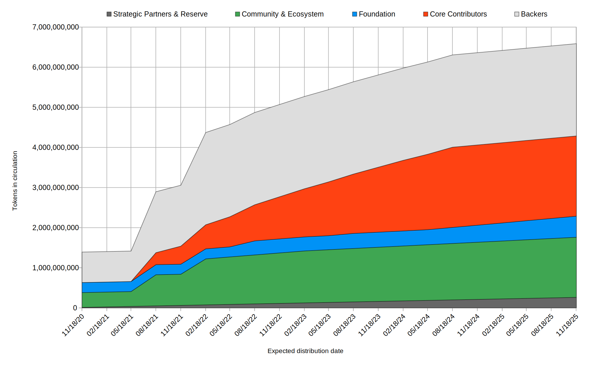
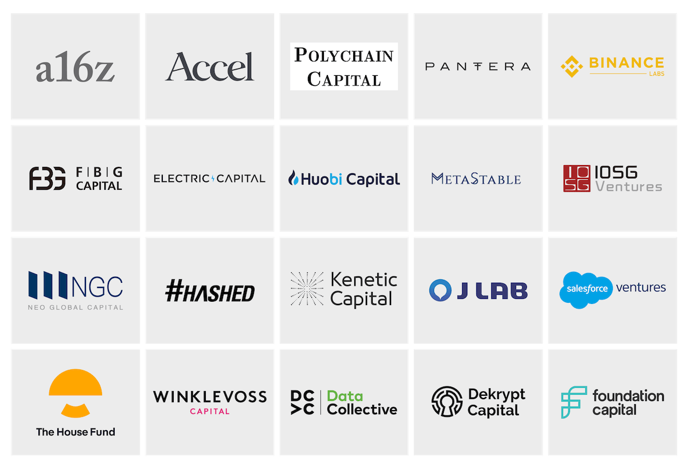

# Token Metrics and Distribution

## Quick Token Facts

**Supply**:  The ROSE native token is a capped supply token. The circulating supply at launch will be approximately 1.5 billion tokens, and the total cap is fixed at 10 billion tokens.

**Token utility:** The ROSE token will be used for transaction fees, staking, and delegation at the Consensus Layer.

**Staking rewards**: \~2.3 billion tokens will be automatically paid out as staking rewards to stakers and delegators for securing the network over time.

## Token Distribution

The quantity of ROSE tokens reserved for various network functions, as a percentage of the total existing token supply, approximately follows the distribution below.

:::caution

Please note that these percentages and allocations are subject to change as we finalize the logistics for the network and its related programs.

:::

### Token Distribution Glossary

**Backers**: Tokens sold directly to backers prior to mainnet launch. The vast majority of these sales took place in 2018.

**Core Contributors**: Compensation to core contributors for contributing to the development of the Oasis Network.

**Foundation Endowment**: Endowment to the Oasis Foundation to foster the development and maintenance of the Oasis Network.

**Community and Ecosystem**: Funding programs and services that engage the Oasis Network community, including developer grants and other community incentives by the Oasis Foundation.

**Strategic Partners and Reserve**: Funding programs and services provided by key strategic partners in the Oasis Network.

**Staking Rewards**: Rewards to be paid out on-chain to stakers and delegators for contributing to the security of the Oasis Network.

### Circulating Supply

Not all tokens have been released publicly or will be released publicly by Mainnet launch. Due to release schedules and locks, only a fraction of the total existing token supply will be in circulation at the time of Mainnet. Approximately 1.5 billion tokens out of a fixed supply of 10 billion tokens in total will be in circulation immediately upon Mainnet. In addition, a portion of Foundation tokens that are not in the circulation supply at launch are staked on the network. Any staking rewards earned will go back into the network via future validator delegations, network feature development, and ecosystem grants.

Tokens set aside for Staking Rewards will be disbursed in accordance with on-chain reward mechanisms which calculate rewards based on how many blocks are proposed by validator, how many blocks are signed by a
validator, how many nodes are participating in staking, and how many tokens are staked etc.
The remaining allocations will be disbursed according to the following release schedule:

Alternative formats: [CSV](/oasis-network-primer/token_distribution.csv), [OpenDocument](/oasis-network-primer/token_distribution.ods)

## Fundraising History

Between 2018 and 2020 Oasis has raised over $45 million from backers including:

## Staking Incentives

Given the Oasis Network’s founding vision to become a world-class, public, permissionless blockchain platform, the contributing team at Oasis has been focused on ensuring that setting up a node is as seamless as possible for all community members. To that end, we’ve put a lot of thought into making sure our staking conditions minimize barriers to entry and encourage meaningful engagement on the network. Some key parameters include:

* **Number of validators to participate in the consensus committee (and receive staking rewards):** 120. Validators will be based on the stake weight on the network.
* **Minimum stake**: 100 tokens per entity
* **Selection to the consensus committee**: Each entity can have at most one node elected to the consensus committee at a time.
* **Staking rewards**: The network is targeted to reward stakers with rewards of between 2.0% to 20.0% depending on the length of time staked to provide staking services on the network.  In order to be eligible for staking rewards per epoch, a node would need to sign at least 75% of blocks in that epoch.
* **Slashing**: At the time of Mainnet launch, the network will only slash for forms of double-signing. The network would slash the minimum stake amount (100 tokens) and freeze the node. Freezing the node is a precaution in order to prevent the node from being over-penalized. The Network will not slash for liveness or uptime at launch.
* **Unbonding period**: The network will have a \~14 day unbonding period. During this time, staked tokens are at risk of getting slashed for double-signing and do not accrue rewards during this time.
* **Consensus voting power**: The current voting power mechanism is stake-weighted. This means that the consensus voting power of a validator is proportional to its stake. In this model, the network will require signatures by validators representing +2/3 of the total stake of the committee to sign a block. Note that in Tendermint, a validator's opportunities to propose a block in the round-robin block proposer order are also proportional to its voting power.

Alternative formats: [CSV](/oasis-network-primer/staking_rewards.csv), [OpenDocument](/oasis-network-primer/staking_rewards.ods)

## Delegation Policy

The Oasis Protocol Foundation is committed to give delegations to entities participating in various incentivized networks.

For more details, see its [Delegation Policy](/general/foundation/delegation-policy).

## Change Log

* **Apr 28, 2022:**
  * Updated validator set to 120 as reflected in the Oasis Network 2022-04-11 Upgrade.
* **Nov 10, 2021:**
  * Updated validator set to 110 as reflected in the Oasis Network 2021-08-31 Upgrade.
  * Added Circulating Supply title to the part talking about Oasis Network's circulating supply.
* **April 30, 2021:**
  * Updated validator set to 100 as reflected in the Oasis Network Cobalt Upgrade.
* **Jan 15, 2021:**
  * Added section on Foundation's Delegation Policy.
* **Nov 15, 2020:**
  * Corrected the initial validator consensus committee to 80 validators. This reflects what is currently in the community approved genesis file and community proposed upgrade to Mainnet.
* **Nov 2, 2020:**
  * Updated Backers image to include more publicly-known backers.
  * Included a community-proposed (and foundation supported) increase in staking rewards range from 15% - 2% to 20% - 2% over the first four years of the network. Impacted charts (distribution, token delivery schedule, and expected staking rewards) also updated to reflect the increase in staking rewards.
